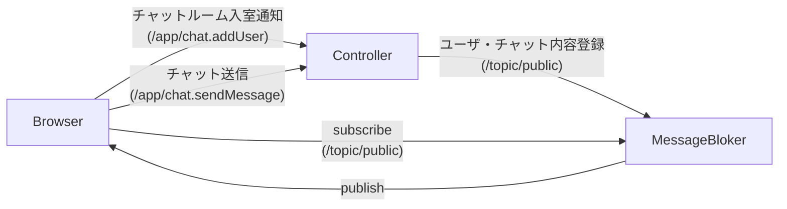
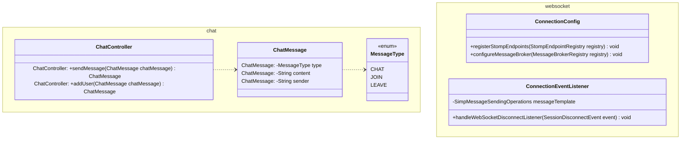

# chat-app
STOMPプロトコルを使用したチャットアプリのサンプル

## 起動方法
- 以下のコマンドを実行する
  - `./mvnw spring-boot:run`

## 機能ブロック図

``` mermaid
flowchart LR
  Browser
  Controller
  MessageBloker
  
  Browser--
    "チャットルーム入室通知
    (/app/chat.addUser)"
  -->Controller

  Browser--
    "チャット送信
    (/app/chat.sendMessage)"
  -->Controller

  Controller--
    "ユーザ・チャット内容登録
    (/topic/public)"
  -->MessageBloker

  Browser--
    "subscribe
    (/topic/public)"
  -->MessageBloker

  MessageBloker--
    "publish"
  -->Browser
```

## クラス図

```mermaid
classDiagram
  namespace chat {
    class ChatController {
      ChatController: +sendMessage(ChatMessage chatMessage) ChatMessage
      ChatController: +addUser(ChatMessage chatMessage) ChatMessage
    }
    class ChatMessage {
      ChatMessage: -MessageType type
      ChatMessage: -String content
      ChatMessage: -String sender
    }
    class MessageType {
      <<enum>>
      CHAT
      JOIN
      LEAVE
    }
  }

  namespace websocket {
    class ConnectionConfig {
      +registerStompEndpoints(StompEndpointRegistry registry) void
      +configureMessageBroker(MessageBrokerRegistry registry) void
    }
    class ConnectionEventListener {
      -SimpMessageSendingOperations messageTemplate
      +handleWebSocketDisconnectListener(SessionDisconnectEvent event) void
    }
  }

  ChatController ..> ChatMessage
  ChatMessage ..> MessageType
```